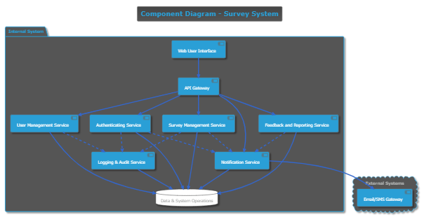

# Component Diagram

This component diagram presents the architecture of the MKB Survey Application. It shows the main functional blocks (components) of the system and how they interact with each other and with external services.

---

## Purpose

The goal of this diagram is to visualize how the system is structured in terms of major components such as user interfaces, core services, authentication, database, and external dependencies. It also clarifies the relationships between components and helps guide development and collaboration.

---

## Components Overview

### Frontend Components

- **Web User Interface (UI)**  
  Presents the front-end to users (students, instructors, and admins).  
  It communicates with backend services through API calls and responsible for displaying forms, dashboards, and dynamic interactions.

### Backend Core Services

- **API Gateway**
  Acts as the single entry point for all frontend requests.
  It handles routing, security, rate limiting, and central access control.

- **Authentication Service (Auth)**
  Handles login, sign-up, logout, and session management.  
  Manages user sessions using JWT or secure cookies.  
  May support external auth providers.

- **User Management Service**  
  Manages user accounts (create, update, delete).  
  Assigns roles such as student, instructor, or admin.  
  Validates user data and manages permissions.

- **Survey Management Service**  
  Creates, modifies, and deletes surveys.  
  Handles business logic related to questions, types of responses, and survey status (active/draft/closed).  
  Interacts with the survey data store.

- **Feedback and Reporting Service**  
  Collects feedback submitted by students.  
  Generates statistics and reports (e.g., CSV, PDF exports).  
  May provide insights to instructors or admins.

- **Notification Service**  
  Sends notifications to users (email confirmations, survey reminders, etc.).  
  Connects to an external messaging service to deliver emails or SMS.

  - **Logging & Audit Service**  
    Records key user and admin actions (e.g., login attempts, survey modifications).
    Useful for transparency and diagnostics.

### Database Layer

- **Application Database (MySQL)**  
  Central data store for:
  - User accounts
  - Survey definitions
  - Feedback responses
  - Generated reports  
    Ensures data integrity, security, and persistence.

### External Dependencies

- **Email/SMS Gateway (External Cloud Service)**  
  An external third-party service used to send notifications triggered by the Notification Service.  
  Examples include SendGrid, Mailgun, Firebase, or Twilio.

---

## Example Workflow

1. A student logs in via the Web UI.
2. The request goes through the API Gateway.
3. API Gateway routes it to the Authenticating Service.
4. Upon successful login, the user is redirected to their role-based dashboard.
5. The user submits a survey; Feedback is passed to the Feedback Service.
6. Feedback is stored in the Database.
7. A notification is triggered and handled by the Notification Service.
8. Notification Service communicates with the Email/SMS Gateway to deliver messages.

---

## Component Diagram

```
@startuml
!theme cyborg

skinparam database {
  BackgroundColor #ffffff
  BorderColor #333333
  RoundCorner 30
}
skinparam shadowing true
skinparam arrowColor #3366cc
skinparam componentBorderColor #666666
skinparam defaultTextAlignment center

title Component Diagram - Survey System

' Define components

package "Internal System" {
  component "Web User Interface" as UI
  component "API Gateway" as APIGW
  component "User Management Service" as UserMgmt
  component "Authenticating Service" as Auth
  component "Survey Management Service" as SurveyMgmt
  component "Feedback and Reporting Service" as FeedbackReport
  component "Notification Service" as Notification
  component "Logging & Audit Service" as Logging
  database "Data & System Operations" as DB
}

cloud "External Systems" {
  [Email/SMS Gateway]
}

' Relationships (Primary Interactions)
UI --> APIGW
APIGW --> Auth
APIGW --> UserMgmt
APIGW --> SurveyMgmt
APIGW --> FeedbackReport
APIGW --> Notification

Auth --> DB
FeedbackReport --> DB
SurveyMgmt --> DB
UserMgmt --> DB
Logging --> DB
Notification --> DB

' Service-to-Service interactions
SurveyMgmt ..> Notification
FeedbackReport ..> Notification
Auth ..> Notification
Auth ..> Logging
UserMgmt ..> Logging
SurveyMgmt ..> Logging 

' External Communication
Notification --> [Email/SMS Gateway]

@enduml

```



---

## Notes

- This version builds on the initial diagram shared by THEOPHILEACHIZA, while integrating suggestions from Philemon, Samuel, and Gauthier.
- The API Gateway is introduced as a central access point to align with service-oriented best practices.
- The Logging & Audit Service is planned for post-MVP to ensure traceability of user actions.
- The "Data & System Operations" component represents a more descriptive view of the database’s strategic role.
- External dependencies such as email/SMS gateways are shown but considered optional for initial MVP implementation.
- This documentation reflects both the MVP focus and future scalability.
