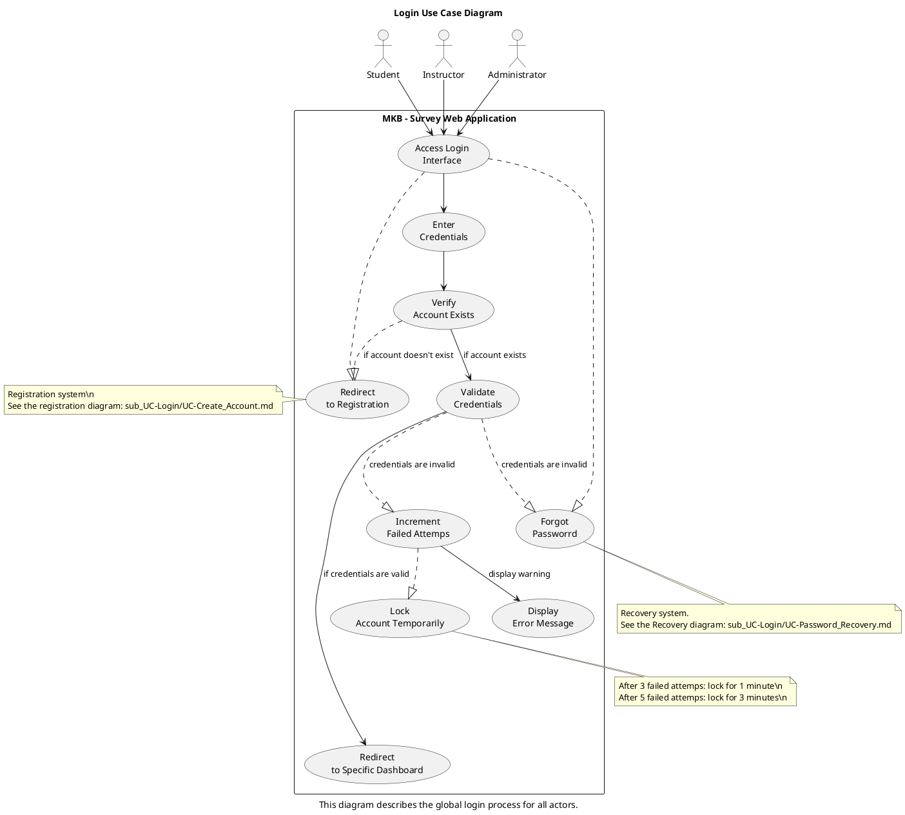
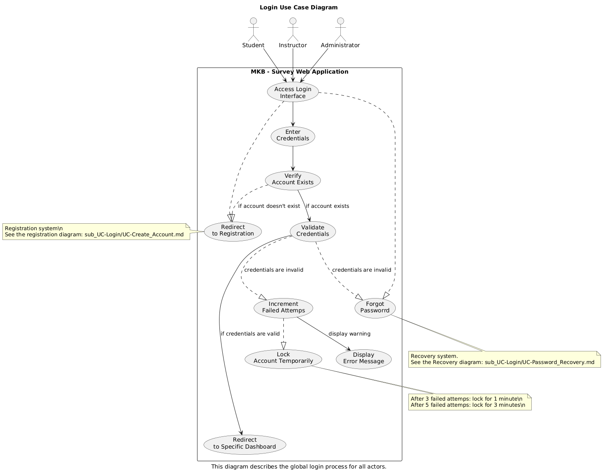

# Use Case: Login

## Actors
- **Student**: Logs in to access and complete surveys.  
- **Instructor**: Logs in to manage class activities and analyze feedback.  
- **Administrator**: Logs in to configure, monitor, and manage the platform. 

## Scope:  
Student Survey Application

## Purpose:  
To securely authenticate users (students, instructors, administrators) and redirect them to their personalized dashboards based on their roles.

## Type:  
Primary

## Overview:  
This use case describes how different users gain access to the system. It focuses on validating credentials to ensure secure, role-based access. For details on account creation or password recovery, please refer to their dedicated use case documents.

## Use Case Diagram

Here's a visual representation of the Login use case:

## Typical Course of Events

| Actor Action| System Response|
| ----------- | ----------- |
| 1. The use case begins when a user clicks on “Create Account.” | |
| 2. The user fills out the form (email and password). | 3. The system validates input format and required fields. |
| 4. | The system checks if the email is already used. |
| 5. | If valid and unique, the system securely stores the new user data. |
| 6. | The system sends a confirmation email (if required), then redirects the user to the login page. |

## Alternative Courses

2a. Invalid or Missing Input  
→ System displays an error and highlights invalid fields.  
→ User is prompted to correct the form.  

5a. Email Already Exists  
→ Message: "An account with this email already exists."  
→ Redirect or prompt to login or reset password.

5a. Password is incorrect  
→ Message: "Password prompted is wrong, please try again"  
→ Redirect or prompt to reset password.  

7a. Database or Network Error  
→ Message: "An error occurred. Please try again later."  
→ Retry available or log support incident.  

## Related Use Cases
[Create Account Use Case Diagram](sub_UC-Login/UC-Create_Account.md) (Sub-use case)
[Password Recovery Use Case Diagram](sub_UC-Login/UC-Password_Recovery.md) (Sub-use case)