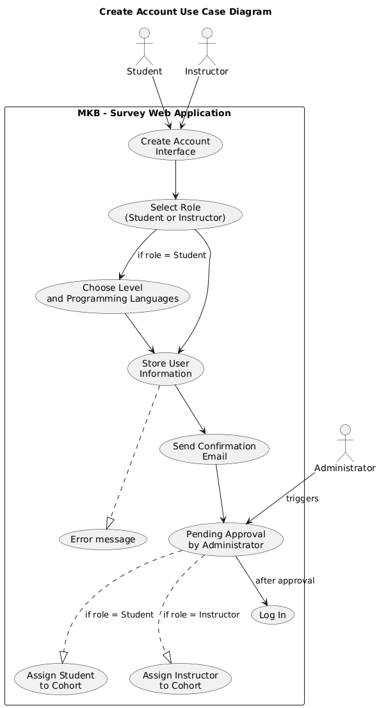

# Use Case: Create Account
## Actors
- **Student:** Registers to access surveys and provide feedback. Must specify academic level and preferred programming languages during registration.

- **Instructor:** Registers to manage cohorts and view student input. No level/language selection but awaits admin assignment.

- **Administrator:** Reviews new registrations and assigns users to appropriate cohorts after approval.

## Scope
Student Survey Application

## Purpose
To allow new users to register by providing personal and role-specific information. Ensures data validation, secure storage, and sets the account in a pending state until approved by an administrator.

## Type
Primary

## Overview
This use case outlines the process of account creation within the system. It includes validation of inputs, ensuring email uniqueness, collecting extra data depending on the user's role, and awaiting administrative approval before allowing access to dashboards.

## Use Case Diagram 
``` plantuml
@startuml
' Title
title Create Account Use Case Diagram

' Direction
' left to right direction

' Actors
actor Student
actor Instructor
actor Administrator

' Use Cases
rectangle "MKB - Survey Web Application" {
  usecase "Create Account\nInterface" as UC1
  usecase "Select Role\n(Student or Instructor)" as UC2
  usecase "Choose Level\nand Programming Languages" as UC3
  usecase "Store User\nInformation" as UC4
  usecase "Error message" as UC5
  usecase "Send Confirmation\nEmail" as UC6
  usecase "Pending Approval\nby Administrator" as UC7
  usecase "Assign Student\nto Cohort" as UC8
  usecase "Assign Instructor\nto Cohort" as UC9
  usecase "Log In" as UC10
}

' Actor Relations
Student --> UC1
Instructor --> UC1
Administrator --> UC7 : triggers

' Use Case Flow
UC1 --> UC2
UC2 --> UC3 : if role = Student
UC2 --> UC4
UC3 --> UC4
UC4 -.-|> UC5
UC4 --> UC6
UC6 --> UC7

UC7 --.|> UC8 : if role = Student
UC7 -.-|> UC9 : if role = Instructor
UC7 --> UC10 : after approval

@enduml
```

## Visual representation

## Typical Course of Events
| Actor Action | System Response |
| ------------ | ----------- |
| 1. A user (Student or Instructor) accesses the registration page.| |
| 2. The user selects their role (Student or Instructor).| |
| 3a. If the user is a Student, they are prompted to choose their academic level and programming languages. | Displays levels and programming languages|
| 3b. If the user is an Instructor, they proceed to the next step. | |
| 4. The user fills out the registration form with personal and login information.| 5. The system validates the inputs and checks that the email is not already used. |
| | 6. If validation passes, the system stores the information and sends a confirmation email. |
| | 7. The user is notified that their account is pending approval by an administrator. |
| 8. The administrator reviews the request. | |
| | 12a. If approved, the student is assigned to a cohort based on their level and preferences. | 
| | 12b. If approved, the instructor is assigned to manage one or more cohorts. |
| | 13. The system activates the account, notifies users and redirects the user to the login page.  |

## Alternative Courses
4a. Invalid or Missing Input  
→ System displays an error and highlights invalid fields.  
→ User is prompted to correct the form.  

5a. Email Already Exists  
→ Message: "An account with this email already exists."  
→ Redirect or prompt to login or reset password.  

6a. Database or Network Error  
→ Message: "An error occurred. Please try again later."   
→ Retry available or log support incident.  

8a. Account Rejected:  
If the administrator rejects the registration, the user is notified by email with the reason provided (optional).  

## Related Use Cases
[Login Use Case Diagram](../UC-Login_new.md) (General use case)  
[Password Recovery Use Case Diagram](UC-Password_Recovery.md)  (Sub-use case)