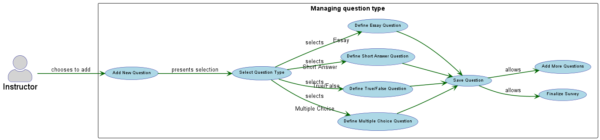

Sub-Use Case: Managing question type.
=================================
**Actors** : Instructor

**Scope**: Software system

**Purpose** : The purpose of this use case is to enable Instructors to effectively construct surveys by providing a flexible and intuitive way to select and define different question formats. 

**Type** : Primary Actor: Instructor

**Overview** : An Instructor initiates the process of adding a new question within a survey. The system then offers a range of question types to choose from. Upon selection, a specialized interface appears, prompting the Instructor to input the question text and any necessary details specific to that question type (e.g., answer choices for a multiple-choice question). Once the question details are entered, the system saves the question, allowing the Instructor to continue building the survey.

Managing question types
-----------
| Actor Action | System Response |
|:--------------|:----------------|
| **1.** Instructor chooses to add a new question: While creating or editing a survey, the Instructor initiates the action to add a new question. | **2.** System presents question type selection: The system displays a list of available question types, such as Multiple Choice, True/False, Short Answer, and Essay. |
| **3.** Instructor selects a question type: The Instructor chooses the desired question type from the provided options. | **4.** System displays question definition interface: The system presents the specific input fields and options relevant to the selected question type (e.g., for a Multiple Choice question, fields for the question text and individual answer options). |   
| **5.** Instructor enters question text and options: The Instructor fills in the question text and any other required details for the chosen question type. | **6.** System saves the question: The system successfully saves the newly defined question and returns the Instructor to the survey editing interface, allowing them to add more questions or finalize the survey structure. |    

Alternative Courses:
-----------
**3a** Instructor cancels question addition: If the Instructor decides not to add a question after seeing the types, they can cancel the operation. <br> $\rightarrow$
 the system returns them to the previous survey editing state.

**5a** Instructor leaves required fields blank: If the Instructor attempts to save a question without filling in all mandatory fields. <br> $\rightarrow$
 the system displays an error message and prompts them to complete the missing information before saving.

Preconditions
-----------
 $\rightarrow$ The Instructor must be logged into the system. 
 <br> $\rightarrow$ The Instructor must be in the process of creating a new survey or editing an existing one.

Postconditions
-----------
$\rightarrow$ A new question, with its defined type and content, is added to the survey.
$\rightarrow$ The Instructor can continue adding more questions or finalize the survey. <br>
$\rightarrow$ If the operation was cancelled, the survey remains in its previous state. <br>

```markdown

@startuml
left to right direction

skinparam usecase {
    BackgroundColor lightblue
    BorderColor darkblue
    ArrowColor darkgreen
    FontName Arial
    FontSize 10
    StereotypeFontColor darkblue
}
skinparam actor{
    BorderColor darkblue
    BackgroundColor lightgray
    FontName Arial
    FontSize 19
}
skinparam arrow{
    color darkgreen
    Thickness 1.5
}

skinparam ActorStyle awesome
actor "Instructor" as Instructor

rectangle "Managing question type" {
  usecase "Add New Question" as UC1
  usecase "Select Question Type" as UC2
  usecase "Define Multiple Choice Question" as UC3a
  usecase "Define True/False Question" as UC3b
  usecase "Define Short Answer Question" as UC3c
  usecase "Define Essay Question" as UC3d
  usecase "Save Question" as UC4
  usecase "Finalize Survey" as UC5
  usecase "Add More Questions" as UC6
}

Instructor --> UC1 : chooses to add
UC1 --> UC2 : presents selection
UC2 --> UC3a : selects "Multiple Choice"
UC2 --> UC3b : selects "True/False"
UC2 --> UC3c : selects "Short Answer"
UC2 --> UC3d : selects "Essay"


UC3a --> UC4 
UC3b --> UC4 
UC3c --> UC4 
UC3d --> UC4 

UC4 --> UC5 : allows
UC4 --> UC6 : allows

@enduml
```


