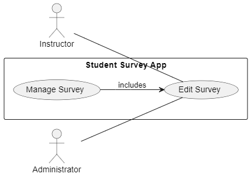

# Use Case: UC-ManageSurveys-Create Survey

## Actors

- **Instructor**: Creates a new survey to be assigned to a class or session.
- **Administrator**: May supervise or manage the availability of survey templates (optional, depending on system design).

**Scope**: Survey Management Module – Create Survey Functionality

**Purpose**: To allow instructors to create a new survey, define its metadata, and prepare it for future publication or distribution to students.

**Type**: Included use case (under the broader "Manage Survey" use case).

**Overview**: This use case describes how an instructor creates a new survey from their dashboard. It includes defining the survey title, description, scheduling dates, and adding initial questions. This use case may extend other use cases like “Manage Questions” and can be triggered as part of “Manage Survey”.

---

## Use Case Diagram

```
@startuml
left to right direction

actor Instructor
actor Administrator

rectangle "Survey Management Module" {
  usecase "Manage Survey" as manage
  usecase "Create Survey" as create
  usecase "Manage Questions" as questions
}

Instructor -- (create)
Administrator ..> (create) : monitors
(create) .> (questions) : includes
(manage) --> (create)

@enduml
```

Here's a visual representation of the Login use case:



---

## Typical Course of Events

| Actor Action                                          | System Response                                                                       |
| ----------------------------------------------------- | ------------------------------------------------------------------------------------- |
| 1. The Instructor logs into their dashboard.          | 2. The system authenticates and presents the survey tools.                            |
| 3. The Instructor clicks “Create New Survey.”         | 4. The system presents a form for entering title, description, open/close dates, etc. |
| 5. The Instructor fills out the details and proceeds. | 6. The system validates the input and saves the draft.                                |
| 7. The Instructor is prompted to add questions.       | 8. The system redirects to the “Manage Questions” interface.                          |

---

## Alternative Courses

**3a.** **Missing Metadata:** The system displays a warning if required fields (title, dates) are empty or invalid.

**6a.** **System Save Error:** The system displays an error and allows the user to retry saving.

---

## Preconditions

- The Instructor is authenticated and has access to the survey dashboard.

  ***

## Postconditions

- TA draft survey is saved in the system.
- The Instructor can proceed to add or edit questions.
