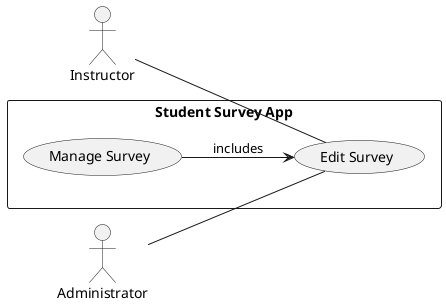

# Use Case: UC-ManageSurveys-Edit Survey

## Actors
- **Instructor**: Edits existing surveys to update content or settings.
- **Administrator** (optional): May oversee survey modification depending on access permissions.

## Scope
Student Survey Management System

## Purpose
To allow authorized users (primarily instructors) to modify the content, structure, or metadata of an existing survey before or during its usage.

## Type
Primary

## Overview
This use case describes how instructors can edit surveys they have previously created. The system allows changes to survey title, description, opening/closing dates, and individual questions. Modifications to active surveys may trigger system alerts or limitations depending on survey status and existing responses.

---

## Use Case Diagram

Here's a visual representation of the Login use case:

---

## Typical Course of Events

| Actor Action                                                       | System Response                                              |
| ------------------------------------------------------------------ | ------------------------------------------------------------ |
| 1. Instructor accesses the list of their existing surveys.         | 2. System displays a list with edit options.                 |
| 3. Instructor selects a survey to edit.                            | 4. System loads current survey details and form.             |
| 5. Instructor modifies metadata (e.g., title, description, dates). | 6. System updates the metadata in the database.              |
| 7. Instructor edits one or more questions.                         | 8. System checks for validation and updates saved questions. |
| 9. Instructor saves the survey.                                    | 10. System confirms changes and shows updated preview.       |

---

## Alternative Courses

**3a.** **The selected survey is already closed:** System prevents editing and displays a message: “This survey is closed and cannot be edited.”

**5a.** **Instructor inputs invalid data:** System displays error message and prompts correction.

**7a.** **Instructor tries to delete a question that has already received responses:** System warns: “Deleting this question will invalidate existing responses.”

---

## Preconditions

- Survey is updated and saved with new configuration.
- If edited while active, changes may affect current student responses.
- System logs the modification with timestamp and user info.

---

## Postconditions

- Survey is updated and saved with new configuration.
- If edited while active, changes may affect current student responses.
- System logs the modification with timestamp and user info.

