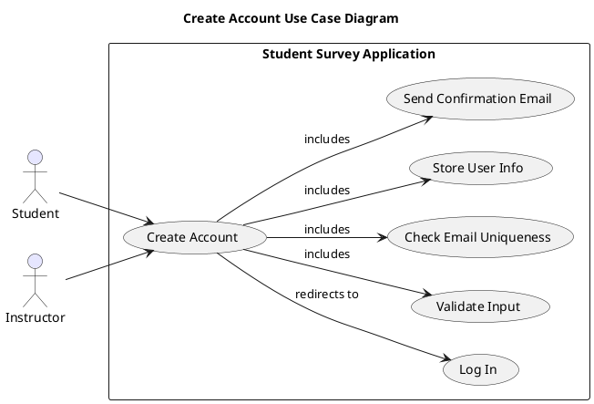

# Use Case: Create Account
**Actors**
- **Student:** Registers to gain access to surveys and submit feedback.

- **Instructor:** Registers to manage courses and review student input.

**Scope:** Student Survey Application  
**Purpose:** To allow new users to register an account by providing personal and role-based information, enabling secure future access to the system.  
**Type:** Primary  
**Overview:** This use case describes how users create an account within the platform. It ensures that valid and unique information is provided, the password is securely stored, and the new user is redirected to log in. For authentication and password recovery, see the corresponding use cases.

## Use Case Diagram 

## Visual representation

## Typical Course of Events
| Actor Action | System Response |
|:--------------|:----------------|
|1. The use case begins when a user clicks on “Create Account.”| |	
|2. The user fills out the form (name, email, password, role, etc.).|3. The system validates input format and required fields.|
|4.	| The system checks if the email is already used.|
|5. | If valid and unique, the system securely stores the new user data.|
|6.	| The system sends a confirmation email (if required), then redirects the user to the login page.|

## Alternative Courses
2a. Invalid or Missing Input
→ System displays an error and highlights invalid fields.
→ User is prompted to correct the form.

4a. Email Already Exists
→ Message: "An account with this email already exists."
→ Redirect or prompt to login or reset password.

6a. Database or Network Error
→ Message: "An error occurred. Please try again later."
→ Retry available or log support incident.