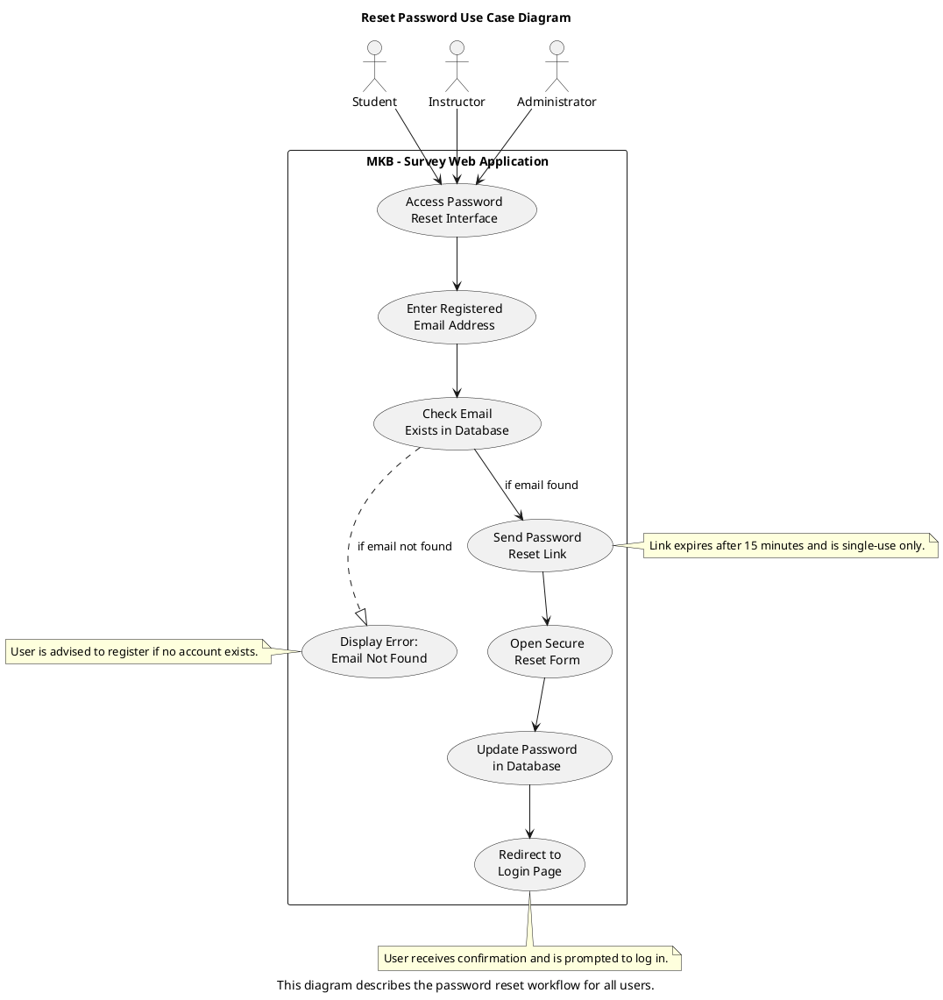
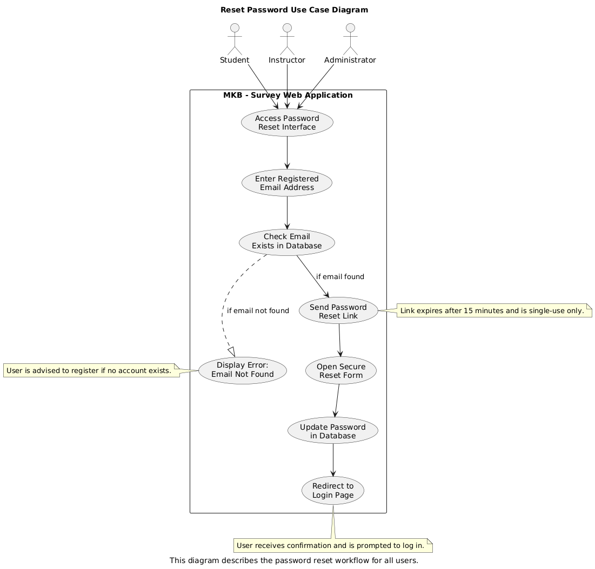

# Use Case: Reset Password 

## Actors
- **Student:** Requests password reset to regain access.  
- **Instructor:** Uses password recovery to log back into the platform.  
- **Administrator:** Recovers access through password reset (with enhanced fallback procedures).  

## Scope:  
Student Survey Application  

## Purpose:  
To help users securely reset their password when they forget or lose access.  

## Type:  
Primary  

## Overview:  
This use case outlines the steps involved when a user initiates a password reset request, validates ownership via email, and updates their password securely.

## Use Case Diagram

## Visual representation

## Typical Course of Events
| Actor Action | System Response|
|:--------|:-------|
| 1. The user clicks “Forgot Password?” on the login page. | |  
| 2. The user enters their registered email address.| 3. The system verifies that the email exists in the database.|  
| 4.| If valid, the system sends a secure reset link to the user’s email.|  
| 5. The user clicks the reset link.| 6. The system displays a secure password reset form.|  
| 7. The user enters a new password and submits.| 8. The system validates and updates the password.|  
| 9.| A confirmation message is shown and the user is redirected to the login page.|  

## Alternative Courses
3a. Email Not Registered  
→ Message: "No account found for this email."  
→ Prompt user to retry or create a new account.  

4a. Email Delivery Failure  
→ Message: "We were unable to send the reset link. Please try again later."  
→ System logs the failure; retry option available.  

## Admin Special Case
→ If an Administrator cannot receive emails:  
→ Instructions are shown to reset password manually via database access (e.g., cPanel or phpMyAdmin).  
→ Admin must hash the new password using the system’s hashing standard.  

## Related Use Cases
[Login Use Case Diagram](../UC-Login_new.md) (General Use case)  
[Create Account Use Case Diagram](UC-Create_Account.md) (Sub-use case)