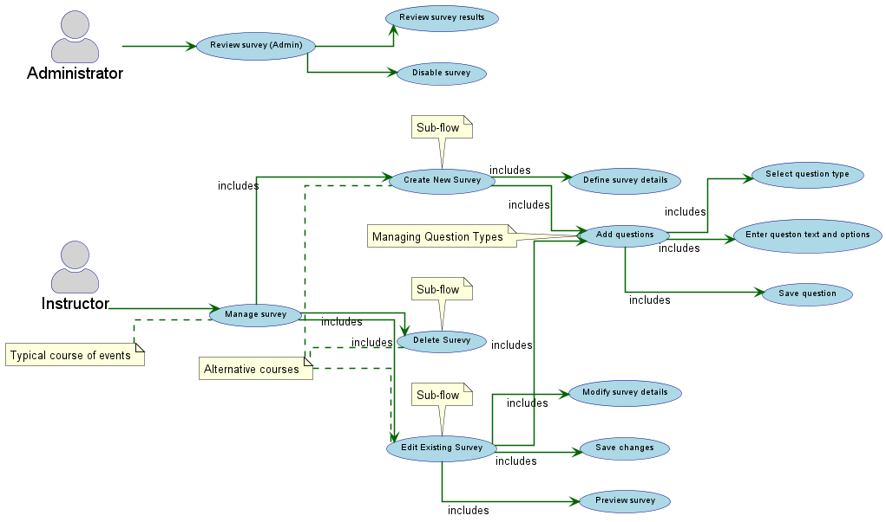

Use Case: Manage survey.
=================================
**Actors**: Instructor, Administor

**Scope**: Software system

**Purpose**: Enable instructors to create, edit, and delete surveys for students.

**Type**: Primary 

**Overview**: This use case describes how an instructor manages surveys within the system.  
the instructor can create new surveys, edit existing ones, and delete those that are no longer needed.  
the system provides an intuitive interface to easily manage surveys to ensure they remain up-to-date  
and relevant to participant needs. This process facilitates the collection of relevant data  
and preparation of surveys for effective delivery.


Typical course of events:
----------------------

| Actor Action | System Response |
|:--------------|:----------------|
| **1.** The Instructor navigates to the survey management section of the system. | **2.** The system displays a list of existing surveys created by the instructor, along with options to create a new survey, edit an existing one, or delete a survey. |
| **3.** The Instructor chooses to either:
**3a.** The Instructor selects the "Create New Survey" option. | **4.** The system presents the Instructor with an interface to define survey details such as title, description, opening date, and closing date. |
| **3b.** The Instructor selects a survey from the list. |  **7.** The system displays the selected survey with options to modify its details (title, dates) and questions. |
| **3c.** The Instructor selects a survey from the list and chooses the "Delete" option. | **10.** The system prompts the Instructor for confirmation to delete the selected survey |
| **5.** The Instructor enters the survey details and proceeds to add questions. | **6.** The system provides tools for the Instructor to create different types of questions (e.g., multiple choice, text-based), define answer options, and mark questions as mandatory or optional. |
| **8.** The Instructor modifies the survey details or questions as needed. | **9.** The system saves the changes made by the Instructor. |
| **11.** The Instructor may choose to preview the survey before finalizing it. | **12.** The system displays a preview of the survey as it would appear to the respondents. |


Alternative Courses:
-----------
**3a :** The Instructor attempts to create a new survey and leaves the 'Title' field blank. <br> $\rightarrow$ The system displays an error message

**9 :** The system fails to save the changes due to a technical issue.<br> $\rightarrow$ The system displays an error message and might suggest retrying.

**12 :** During the survey preview, the system encounters an error rendering a specific question type. <br> $\rightarrow$ The system displays a generic error message for that section and advises the instructor to review the question setup.
   

Section: MANAGING QUESTION TYPES
-----------
| Actor Action | System Response |
|:--------------|:----------------|
| **1.** While creating or editing a survey, the Instructor chooses to add a new question. | **2.** The system presents a selection of available question types (e.g., Multiple Choice, True/False, Short Answer, Essay). |
| **3.** The Instructor selects a question type. | **4.** The system displays the specific interface for defining the selected question type (e.g., for Multiple Choice, fields to enter the question text and answer options). |   
| **5.** The Instructor enters the question text and relevant options | **6.** The system saves the question and allows the Instructor to add more questions or finalize the survey structure. |  


```markdown
    
    @startuml

left to right direction

skinparam usecase {
    BackgroundColor lightblue
    BorderColor darkblue
    ArrowColor darkgreen
    FontName Arial
    FontSize 10
    StereotypeFontColor darkblue
}
skinparam actor{
    BorderColor darkblue
    BackgroundColor lightgray
    FontName Arial
    FontSize 19
}
skinparam arrow{
    color darkgreen
    Thickness 1.5
}
skinparam Linetype ortho

skinparam ActorStyle awesome
actor Instructor
actor Administrator

usecase "Manage survey" as ManageSurvey
usecase "Create New Survey" as CreateNewSurvey
usecase "Edit Existing Survey" as EditSurvey
usecase "Delete Surevy" as DeleteSurvey
usecase "Define survey details" as DefineDetails
usecase "Add questions" as AddQuestions
usecase "Modify survey details" as ModifyDetails
usecase "Save changes" as SaveChanges
usecase "Preview survey" as PreviewSurvey
usecase "Review survey results" as ReviewResults
usecase "Select question type" as SelectQuestionType
usecase "Enter queston text and options" as EnterQuestionOptions
usecase "Save question" as SaveQuestion
usecase "Review survey (Admin)" as ReviewSurveyAdmin
usecase "Disable survey" as DisableSurvey 

Instructor --> ManageSurvey
Administrator --> ReviewSurveyAdmin

ManageSurvey --> CreateNewSurvey : includes
ManageSurvey --> EditSurvey : includes
ManageSurvey --> DeleteSurvey : includes

CreateNewSurvey --> DefineDetails : includes
CreateNewSurvey --> AddQuestions : includes
EditSurvey --> ModifyDetails : includes
EditSurvey --> AddQuestions : includes
EditSurvey --> SaveChanges : includes
EditSurvey --> PreviewSurvey : includes

AddQuestions --> SelectQuestionType : includes
AddQuestions --> EnterQuestionOptions : includes
AddQuestions --> SaveQuestion : includes

ReviewSurveyAdmin --> ReviewResults
ReviewSurveyAdmin --> DisableSurvey

note top of CreateNewSurvey : Sub-flow
note top of EditSurvey : Sub-flow
note top of DeleteSurvey: Sub-flow

note "Typical course of events" as TypicalCourse
TypicalCourse .. ManageSurvey

note "Alternative courses" as AlternativeCourses
AlternativeCourses .. CreateNewSurvey
AlternativeCourses .. EditSurvey
AlternativeCourses .. DeleteSurvey

note "Managing Question Types" as ManagingQuestionTypes
ManagingQuestionTypes .. AddQuestions

@enduml
```


