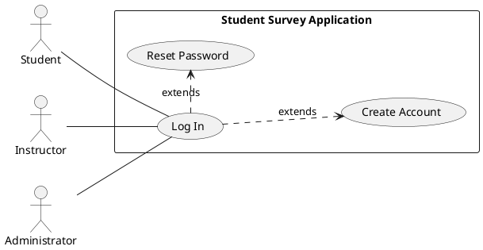
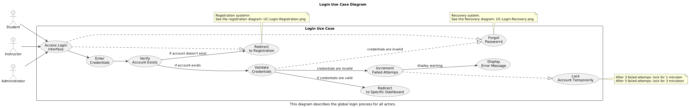

# How-To: Diagram a Use Case

This document outlines the process for creating and incorporating Use Case Diagrams into our Markdown (`.md`) documentation files, ensuring they are viewable both as PlantUML source code and as rendered images on GitHub.

We will use the **UC-Login.md** file as a practical example to walk through the entire process.

---

## Prerequisites

Before you start, ensure you have:

1.  **Visual Studio Code (VS Code):** Our primary editor for documentation and PlantUML.
2.  **PlantUML Extension for VS Code:**
    * Open VS Code.
    * Go to the Extensions view (Ctrl+Shift+X or Cmd+Shift+X).
    * Search for `PlantUML` and install the official extension (by PlantUML).
3.  **PlantUML Extension Configuration:**
    * Open VS Code Settings (Ctrl+, or Cmd+,).
    * Search for `PlantUML` settings.
    * Locate the `Plantuml: Render` option and set it to `PlantUMLServer`.
    * Locate the `Plantuml: Server` option and ensure it's set to the official PlantUML server address: `http://www.plantuml.com/plantuml/` (This allows VS Code to render previews).

---

## Process: Adding a Use Case Diagram

Follow these steps for any use case you wish to diagram, using `UC-Login.md` as our example.

### Step 1: Define Your Use Case (.md File)

First, ensure your Use Case Markdown file is structured and contains the necessary textual details.

**Example `UC-Login.md` structure (condensed for this step):**

```markdown
# Use Case: Login
=================================
**Actors**: Student, Instructor, Administrator
**Scope**: Student Survey Application
**Purpose**: To securely authenticate users...
**Type**: Primary
**Overview**: This use case describes how different users gain access...
Step 2: Write Your PlantUML Diagram Code
Directly within your .md file, you will embed the PlantUML source code for your diagram. Use a plantuml fenced code block. This allows the source code to be visible directly in the Markdown document.

Example PlantUML Code Block (to be added to UC-Login.md):

Markdown

## Use Case Diagram (Source Code)


### Step 3: Preview the Diagram in VS Code

While you're writing the PlantUML code within your `.md` file:

1.  **Open the Command Palette:** Press `Ctrl+Shift+P` (Windows/Linux) or `Cmd+Shift+P` (Mac).
2.  **Search for "PlantUML":** Type `PlantUML` and select "PlantUML: Preview Current Diagram" or "PlantUML: Preview Diagram (from current editor)". This will open a side panel showing the rendered diagram.
    * **Note:** If you're embedding PlantUML directly in an `.md` file, the extension might require you to highlight the PlantUML code block first, or it might try to render any `.puml` files in the workspace. For reliable previewing, it's often easier to temporarily copy the `@startuml ... @enduml` block into a dedicated `.puml` file during active editing, then copy it back once complete.

### Step 4: Generate the PNG Image for GitHub Display

GitHub's native Markdown renderer does **not** execute PlantUML code blocks or render `.puml` files directly. To make your diagram visible as an image on GitHub, you must:

1.  **Extract PlantUML Source:** Copy the entire `@startuml ... @enduml` block from your `.md` file.
2.  **Create a temporary `.puml` file:** Paste the copied code into a new temporary file, e.g., `temp_diagram.puml`, and save it in the same directory as your `UC-Login.md`.
3.  **Export the Diagram:**
    * Open `temp_diagram.puml` in VS Code.
    * Right-click in the editor and select "PlantUML: Export Current Diagram".
    * Choose `PNG` as the format.
    * Save the file with a clear name (e.g., `UC-Login.png`) in the **same directory** as your `UC-Login.md` file.
    * You can now delete `temp_diagram.puml`.

### Step 5: Incorporate the PNG Image into Your Markdown File

Finally, add the Markdown image link to your `.md` file, pointing to the `.png` image you just generated. This link ensures the visual diagram appears when the `.md` file is viewed on GitHub.

**Example Image Link (to be added to `UC-Login.md`):**

```markdown
## Use Case Diagram (Rendered)


Step 6: Commit and Push to GitHub
Ensure both your updated .md file (e.g., UC-Login.md) and the newly generated .png image (e.g., UC-Login.png) are committed and pushed to your GitHub repository. When viewing the .md file on GitHub, you will now see both the PlantUML source code block and the rendered PNG image.


---
