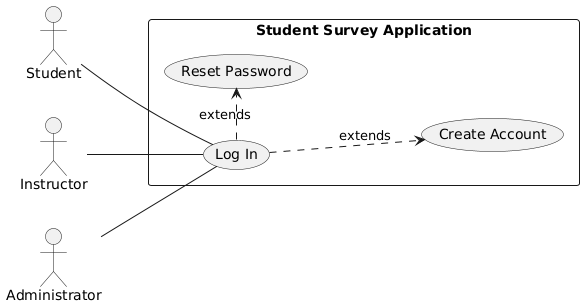

# Use Case: Login

## Actors
- **Student**: Logs in to access and complete surveys.  
- **Instructor**: Logs in to manage class activities and analyze feedback.  
- **Administrator**: Logs in to configure, monitor, and manage the platform. 

**Scope**: Student Survey Application

**Purpose**: To securely authenticate users (students, instructors, administrators) and redirect them to their personalized dashboards based on their roles.

**Type**: Primary

**Overview**: This use case describes how different users gain access to the system. It focuses on validating credentials to ensure secure, role-based access. For details on account creation or password recovery, please refer to their dedicated use case documents.

---

## Use Case Diagram
```
@startuml
left to right direction

actor Student
actor Instructor
actor Administrator

rectangle "Student Survey Application" {
  usecase "Log In" as login
  usecase "Create Account" as register
  usecase "Reset Password" as reset
}

Student -- (login)
Instructor -- (login)
Administrator -- (login)

(login) ..> (register) : extends
(login) .> (reset) : extends

@enduml
```

Here's a visual representation of the Login use case:



---

## Typical Course of Events

| Actor Action | System Response |
|:--------------|:----------------|
| 1. This use case begins when a Student, Instructor, or Administrator attempts to access the platform. | |
| 2. The actor provides their username and password. | 3. The system verifies the provided credentials and account status. |
| 4. | 5. If credentials are correct and the account is active, the system logs the user in and redirects them to their role-specific dashboard. |

---

## Alternative Courses

**1a.** **Account does not exist:** If the system cannot find a matching account, the user is prompted to create one. (Refer to the **"Create Account" Use Case** for details.)

**1b.** **Invalid Credentials / Failed Attempts:** If the username or password is incorrect, the system logs the attempt. After a predefined number of failed attempts, the account is temporarily locked to prevent unauthorized access. (Refer to the **"Password Recovery" Use Case** for options if the user has forgotten their password or is locked out.)