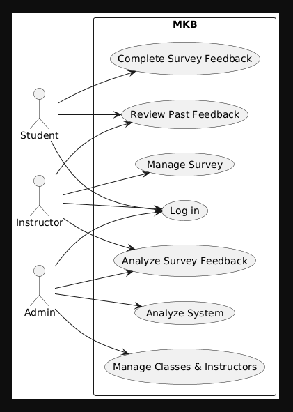

## Diagraming all the use case
# Actor:
1. Student
2. Instructor
3. Admin
``` markdown
@startuml
 
left to right direction
actor "Student" 

left to right direction
actor "Instructor"

 rectangle MKB  {
  usecase "Log in" as UC1
  usecase "Complete Survey Feedback" as UC2
  usecase "Manage Survey" as UC3
  usecase "Review Past Feedback" as UC4
  usecase "Analyze Survey Feedback" as UC5
  usecase "Manage Classes & Instructors" as UC6
  usecase "Analyze System" as UC7
}

 Student --> UC1
 Student --> UC2
 Student --> UC4

 Instructor --> UC1
 Instructor --> UC3
 Instructor --> 
 UC4 Instructor --> UC5

 Admin --> UC1
 Admin --> UC6
 Admin --> UC7
 Admin --> UC5

@enduml
```
Here's a visual representation of all the main Use cases and the user they interact with:
